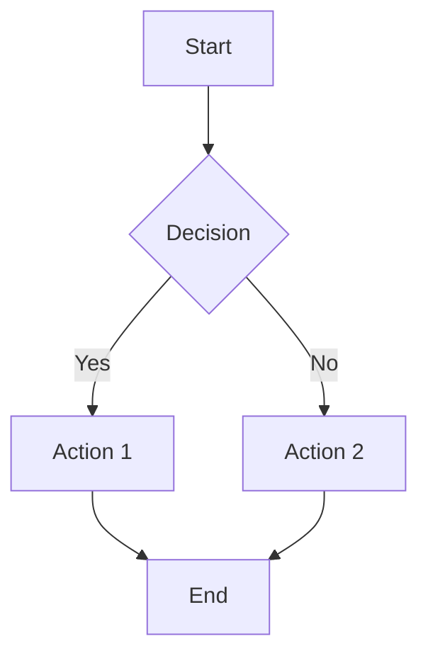

# Getting Started

Get up and running with VitePress Mermaid in minutes.

## Choose Your Starting Point

| Scenario                   | Recommended Approach | Description                                               |
| -------------------------- | -------------------- | --------------------------------------------------------- |
| Creating a new project     | CLI Tool             | Scaffold a pre-configured project with sample diagrams    |
| Existing VitePress project | Manual Integration   | Install and configure the plugin in your existing project |

## Option 1: Scaffold with CLI

Use the `create-vitepress-mermaid` CLI tool to create a new pre-configured project:

::: code-group

```bash [pnpm]
pnpm create @unify-js/vitepress-mermaid
```

```bash [npm]
npm create @unify-js/vitepress-mermaid
```

```bash [yarn]
yarn create @unify-js/vitepress-mermaid
```

:::

After creation, follow the instructions to install dependencies and start the dev server:

```bash
cd <project-name>
npm install  # or pnpm install, yarn
npm run dev  # or pnpm dev, yarn dev
```

The generated project includes sample Mermaid diagrams and complete TypeScript configuration.

## Option 2: Integrate into Existing Project

### Installation

Install the plugin using your preferred package manager:

::: code-group

```bash [pnpm]
pnpm add -D @unify-js/vitepress-mermaid
```

```bash [npm]
npm install -D @unify-js/vitepress-mermaid
```

```bash [yarn]
yarn add -D @unify-js/vitepress-mermaid
```

:::

### Dependency Requirements

This custom theme requires the following dependencies to work properly. Please make sure they are installed:

```bash
pnpm add -D vitepress mermaid
```

### Configuration

#### Step 1: Configure VitePress Config

Create or edit your `.vitepress/config.ts` file:

```typescript
import { defineConfig } from 'vitepress';
import { withMermaidConfig } from '@unify-js/vitepress-mermaid/config';

export default withMermaidConfig(
  defineConfig({
    // Your VitePress config
  })
);
```

#### Step 2: Configure the Theme

Create or edit your `.vitepress/theme/index.ts` file:

```typescript
import type { Theme } from 'vitepress';
import { MermaidTheme } from '@unify-js/vitepress-mermaid';

export default {
  extends: MermaidTheme,
} satisfies Theme;
```

## Usage

Once configured, you can use Mermaid diagrams in your Markdown files:

````markdown

````

This will render as:


**Click on the diagram above** to open the fullscreen preview!
