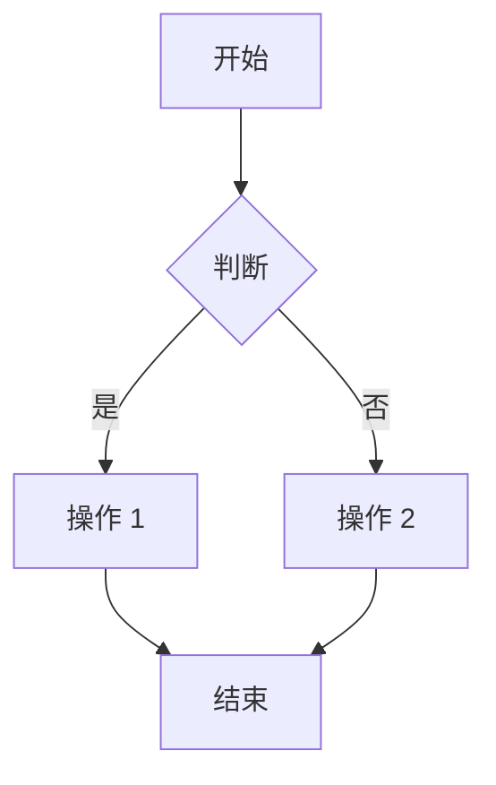

# 快速开始

在几分钟内开始使用 VitePress Mermaid。

## 选择你的开始方式

| 场景                | 推荐方式 | 说明                             |
| ------------------- | -------- | -------------------------------- |
| 创建新项目          | CLI 工具 | 一键生成预配置项目，包含示例图表 |
| 已有 VitePress 项目 | 手动集成 | 安装插件并配置到现有项目         |

## 方式一：使用 CLI 创建新项目

使用 `create-vitepress-mermaid` CLI 工具创建预配置项目：

::: code-group

```bash [pnpm]
pnpm create @unify-js/vitepress-mermaid
```

```bash [npm]
npm create @unify-js/vitepress-mermaid
```

```bash [yarn]
yarn create @unify-js/vitepress-mermaid
```

:::

创建完成后，按照提示安装依赖并启动开发服务器：

```bash
cd <project-name>
npm install  # 或 pnpm install, yarn
npm run dev  # 或 pnpm dev, yarn dev
```

生成的项目包含示例 Mermaid 图表和完整的 TypeScript 配置。

## 方式二：集成到现有项目

### 安装

使用您喜欢的包管理器安装自定义主题：

::: code-group

```bash [pnpm]
pnpm add -D @unify-js/vitepress-mermaid
```

```bash [npm]
npm install -D @unify-js/vitepress-mermaid
```

```bash [yarn]
yarn add -D @unify-js/vitepress-mermaid
```

:::

### 依赖要求

本自定义主题需要以下依赖才能正常工作，请确保已安装：

```bash
pnpm add -D vitepress mermaid
```

### 配置

#### 第一步：配置 VitePress 配置

创建或编辑您的 `.vitepress/config.ts` 文件：

```typescript
import { defineConfig } from 'vitepress';
import { withMermaidConfig } from '@unify-js/vitepress-mermaid/config';

export default withMermaidConfig(
  defineConfig({
    // 您的 VitePress 配置
  })
);
```

#### 第二步：配置主题

创建或编辑您的 `.vitepress/theme/index.ts` 文件：

```typescript
import type { Theme } from 'vitepress';
import { MermaidTheme } from '@unify-js/vitepress-mermaid';

export default {
  extends: MermaidTheme,
} satisfies Theme;
```

## 使用

配置完成后，您可以在 Markdown 文件中使用 Mermaid 图表：

````markdown

````

这会渲染为：


**点击上方的图表** 打开全屏预览！
