# Mermaid Diagram Examples

This page demonstrates various Mermaid diagram types supported by vitepress-mermaid. Click on any diagram to open fullscreen preview.

## Flowchart

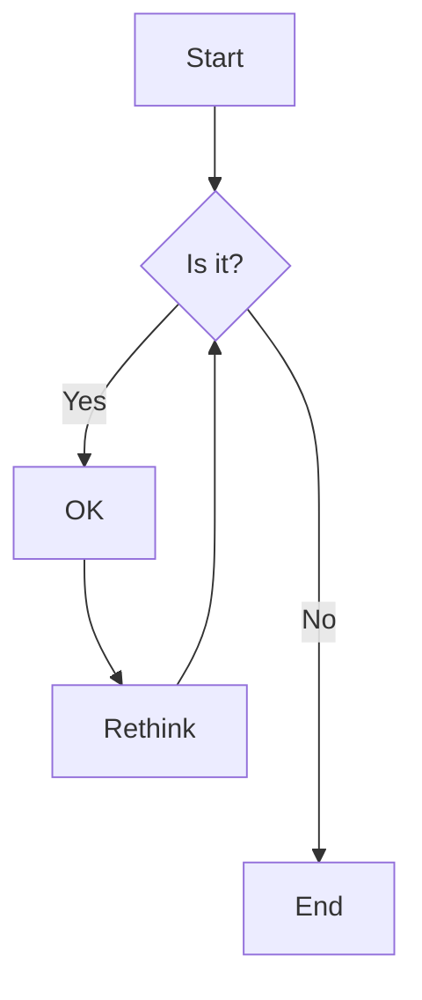

## Sequence Diagram

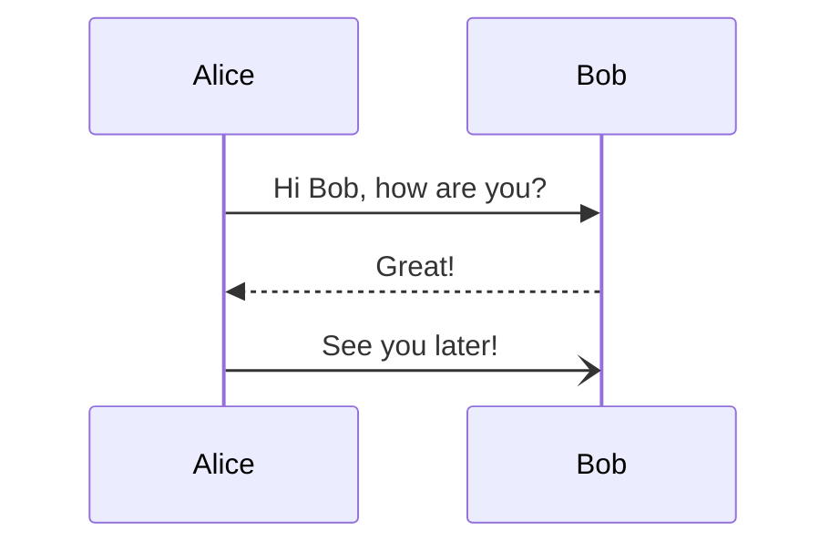

## Class Diagram

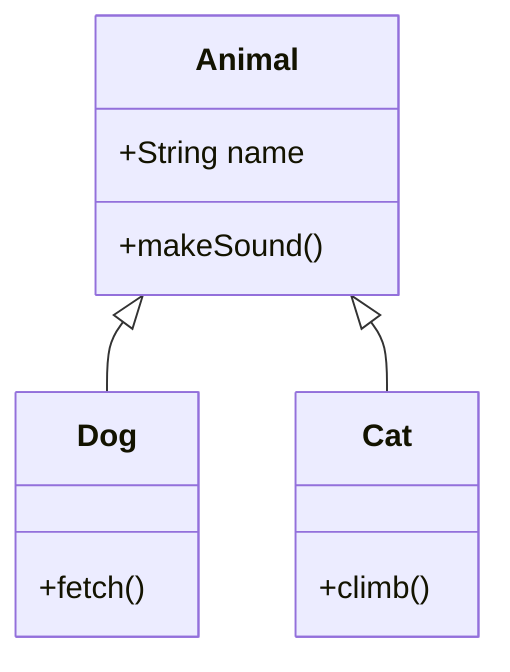

## State Diagram

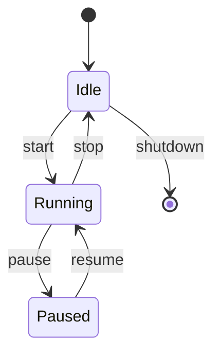

## Entity Relationship Diagram

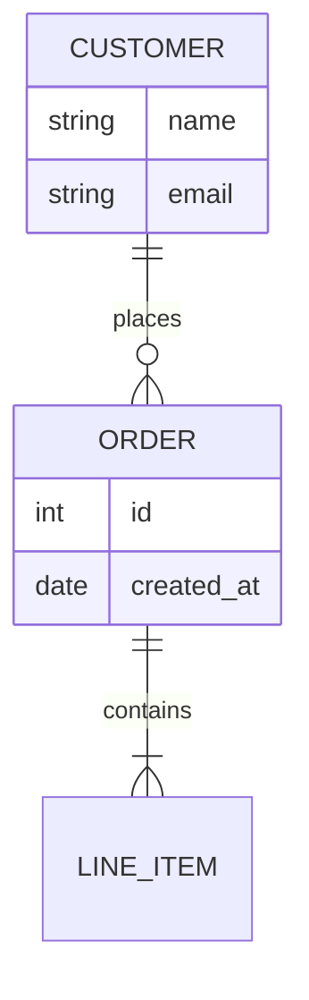

## Gantt Chart

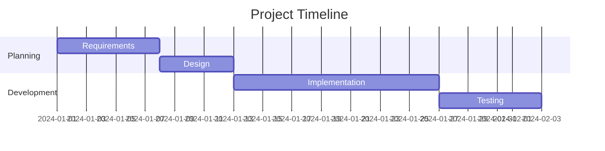

## Pie Chart

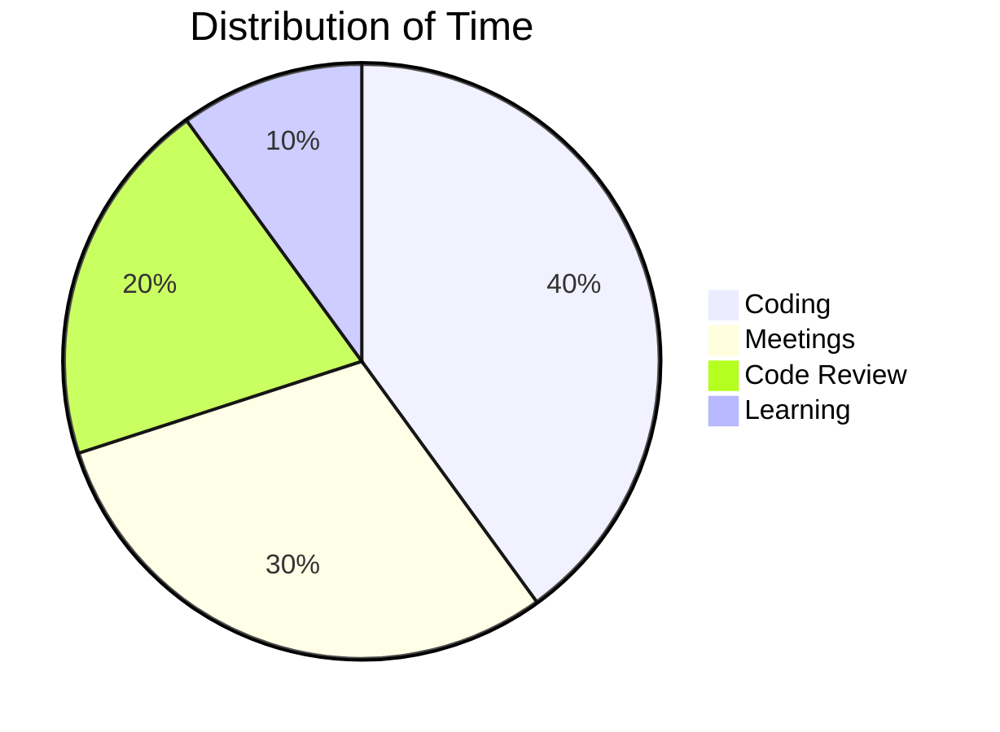

## Git Graph

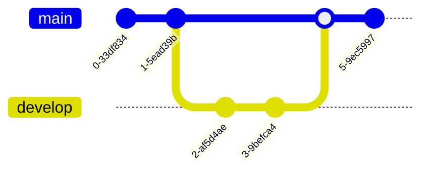

## Mindmap

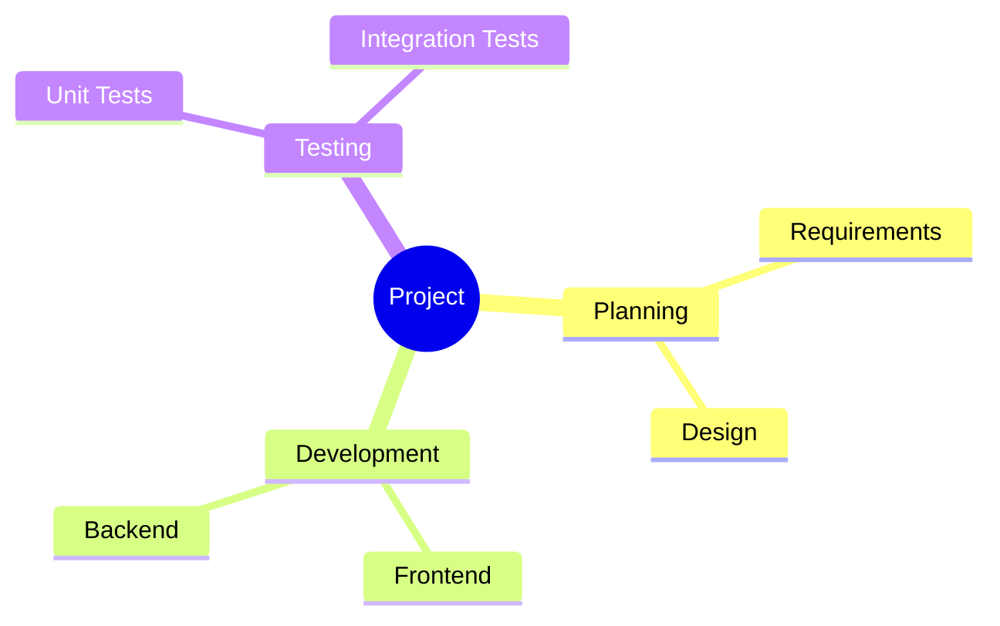

## Timeline

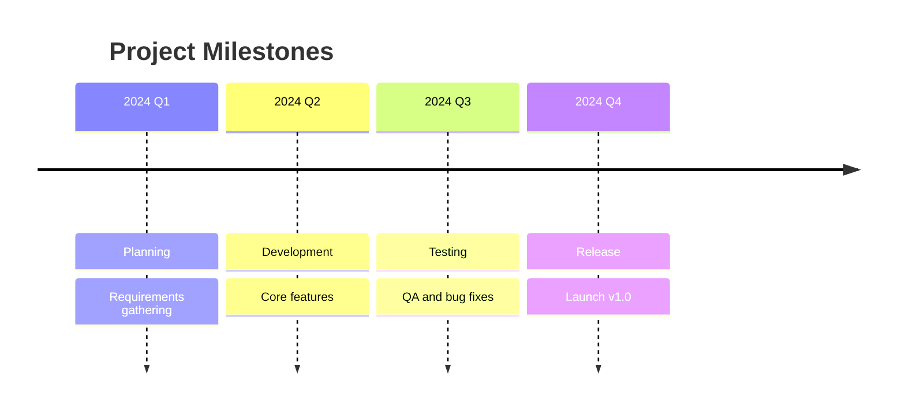

## Quadrant Chart

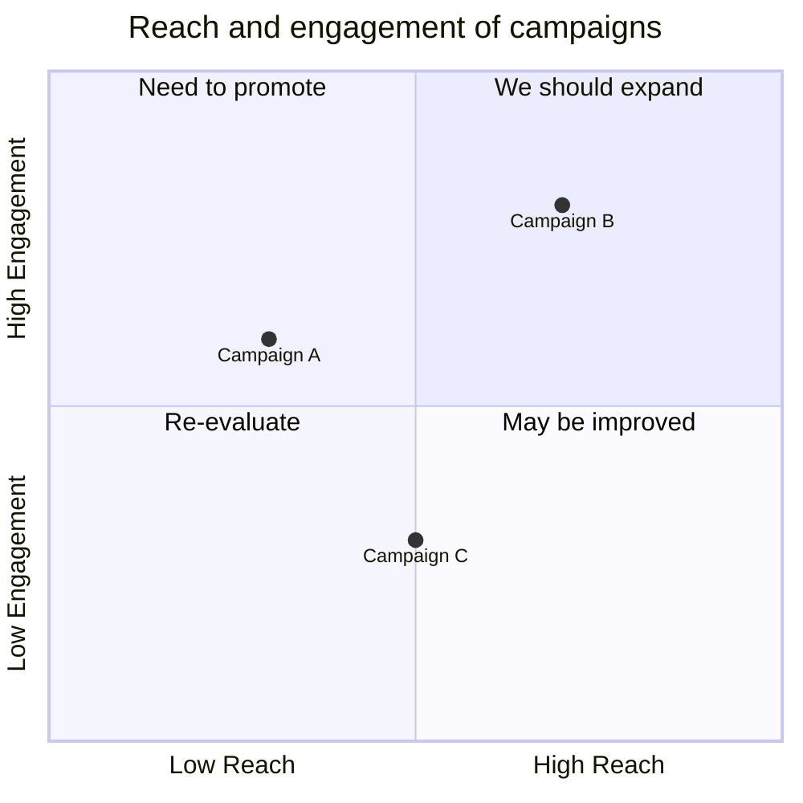
